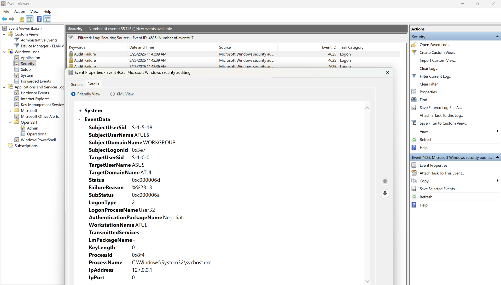
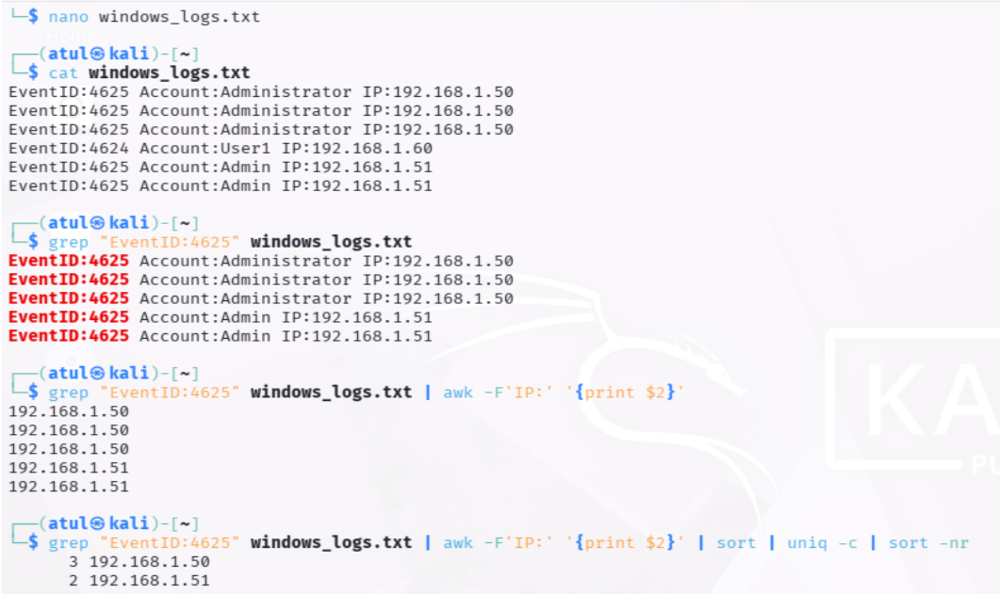
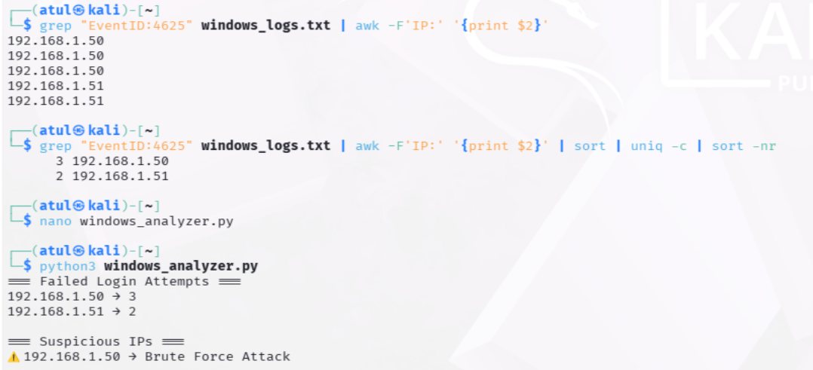

# 🪟 SOC Project 2 – Windows Log Analysis (Brute Force Detection)

---

## 📌 Project Overview

This project demonstrates how a Security Operations Center (SOC) Analyst detects brute-force login attempts using Windows Security Event Logs. The project includes real system log investigation using Event Viewer and simulated log analysis using Linux commands and Python automation.

---

## 🎯 Objective

* Analyze Windows Security Logs
* Detect failed login attempts (Event ID 4625)
* Identify brute-force attack patterns
* Perform manual log analysis using Linux commands
* Automate detection using Python
* Understand multiple log analysis approaches

---

## 🧠 Key Concepts

### 🔴 Event ID 4625 – Failed Login

* Indicates a failed login attempt
* Logged as **Audit Failure**
* Used to detect brute-force attacks

### 🟢 Event ID 4624 – Successful Login

* Indicates successful authentication
* Logged as **Audit Success**

---

## 🛠️ Tools Used

* Windows OS
* Event Viewer
* Linux (Kali)
* Bash (grep, awk, sort)
* Python

---

## 📂 Project Structure

```text
soc-project-2-windows-log-analysis/
│── windows_logs.txt
│── windows_analyzer.py
│── README.md
│── screenshots/
```

---

# 🪟 PART 1: Windows Log Analysis (Real System)

## 📂 Steps Performed

### 🔹 Step 1: Open Event Viewer

* Navigated to:
  `Windows Logs → Security`

---

### 🔹 Step 2: Filter Logs

* Filtered failed logins:

```text
4625
```

* Filtered successful logins:

```text
4624
```

---

### 🔹 Step 3: Analyze Events

* Observed multiple failed login attempts
* Checked timestamps and repetition
* Identified suspicious login pattern

---

### 🔹 Step 4: Deep Investigation

* Opened individual events
* Extracted:

  * Account Name
  * Logon Type
  * Timestamp
  * Event Source

---

### 🔹 Step 5: Brute Force Simulation

* Entered incorrect passwords multiple times
* Generated repeated Event ID 4625 logs
* Confirmed brute-force attack behavior

---

## 📊 Findings (Windows Event Viewer)

* Total Failed Attempts: **7**
* Event ID: **4625**
* Target Account: **ATULS**
* Pattern: Repeated failed attempts in short time

---

## 🚨 Incident Report (Windows Analysis)

| Field          | Details            |
| -------------- | ------------------ |
| Attack Type    | Brute Force Attack |
| Event ID       | 4625               |
| Target Account | ATULS              |
| Attempts       | 7                  |
| Severity       | High               |

---

# 🧪 PART 2: Log File Analysis (Linux + Python)

## 📂 Step 1: Manual Analysis (Linux)

### 🔹 Filter Failed Logins

```bash
grep "EventID:4625" windows_logs.txt
```

---

### 🔹 Extract IP Addresses

```bash
grep "EventID:4625" windows_logs.txt | awk -F'IP:' '{print $2}'
```

---

### 🔹 Count Attempts per IP

```bash
grep "EventID:4625" windows_logs.txt | awk -F'IP:' '{print $2}' | sort | uniq -c | sort -nr
```

---

## 🧑‍💻 Step 2: Python Automation

### 📂 File: `windows_analyzer.py`

```python
from collections import defaultdict
import re

log_file = "windows_logs.txt"
failed_logins = defaultdict(int)

with open(log_file, "r") as file:
    for line in file:
        if "EventID:4625" in line:
            ip_match = re.search(r'IP:(\d+\.\d+\.\d+\.\d+)', line)
            if ip_match:
                ip = ip_match.group(1)
                failed_logins[ip] += 1

print("=== Failed Login Attempts ===")

for ip, count in failed_logins.items():
    print(f"{ip} → {count}")

print("\n=== Suspicious IPs ===")

for ip, count in failed_logins.items():
    if count >= 3:
        print(f"⚠️ {ip} → Brute Force Attack")
```

---

### ▶️ Run Command

```bash
python3 windows_analyzer.py
```

---

## 📊 Findings (Log File + Python Analysis)

From simulated log data:

* 192.168.1.50 → **3 attempts**
* 192.168.1.51 → **2 attempts**

⚠️ IP **192.168.1.50** flagged as suspicious (brute-force pattern)

---

# 🔍 Analysis

Two different analysis approaches were used:

1. **Windows Event Viewer (Real System Logs)**

   * Detected brute-force attack on account **ATULS**
   * Based on repeated Event ID 4625

2. **Linux + Python (Simulated Logs)**

   * Identified suspicious IP based on repeated attempts
   * Automated detection logic implemented

Both approaches demonstrate how SOC analysts perform manual and automated investigations.

---

## 📸 Screenshots

```markdown
failed-logins.png



```

---

## 🎯 Key Takeaways

* Event ID 4625 is critical for detecting failed logins
* Repeated attempts indicate brute-force attacks
* Event Viewer is essential for Windows investigation
* Linux tools help in quick log parsing
* Python automation improves detection efficiency
* Separation of data sources is important in SOC analysis

---

## 🚀 Future Improvements

* Integrate with SIEM tools (Splunk, Wazuh)
* Implement real-time alerting
* Extend detection to network logs

---

## 📌 Conclusion

This project demonstrates a complete SOC workflow including real system log analysis and simulated log processing. It highlights how brute-force attacks can be detected using both manual investigation and automation techniques.

---

## 👨‍💻 Author

**Atul Paswan**
SOC Analyst Learner | Cybersecurity Enthusiast
